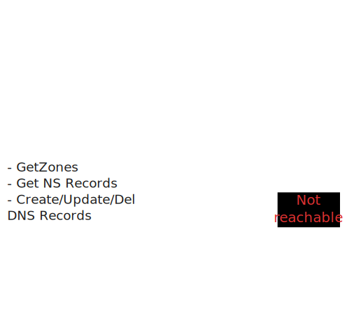
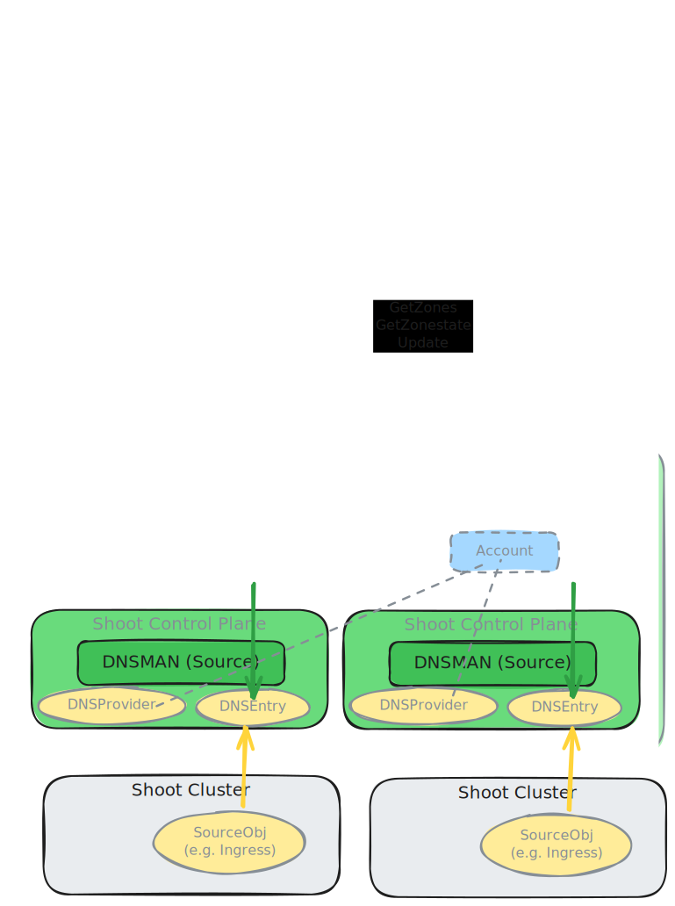

# Migration of `dns-controller-manager` to Next Generation
This document outlines the steps taken to migrate to the next generation of `dns-controller-manager` from [external-dns-management](https://github.com/gardener/external-dns-management).

## Architecture Changes

The `nextgeneration` DNS controller manager makes now use of the authoritative DNS servers for looking up the current state of DNS record whenever possible.
This is a significant change from the previous implementation, which relied on cached data and periodic synchronization to avoid running into rate limits imposed by DNS providers.

In the standard use case of public hosted zones, the next generation controller queries the authoritative DNS servers directly to determine the existing DNS records.

If the authoritative DNS servers are not accessible (e.g., for private hosted zones), the next generation controller falls back to using the provider's API to fetch the current state of DNS records.

It also allows to make far-reaching simplifications to the overall architecture of the DNS controller manager and its deployment.

There is no longer a need for separate caching layers in the form of a seed-wide `dns-controller-manager` and the `Central DNS proxy` to avoid high load by the periodic synchronization.
Instead, for reading the current state of DNS records, the next generation controller directly queries the authoritative DNS servers or falls back to the provider's API if necessary.

### Old Architecture

#### DNS Controller Manager in shoot-dns-service extension namespace
- Manages DNSProviders and DNSEntries for all control planes (and all other namespades)
- DNSProvider with same credentials map to same "account"
- Complete zone state is cached and synchronised periodically
- batches if supported by handler (but only per namespace = group)
- uses zone reconciliations

#### DNS Controller Manager in control plane ("shoot-dns-service" deployment)
- watches shoot cluster for annotated source objects, DNSEntries
- manages "slave" DNSEntries in control plane namespace
- if enabled, may replicate DNSProviders from shoot cluster to control plane namespace
- does NOT communicate with providers

#### DNS Central Proxy in Garden Runtime Cluster
- centralised access to zone of landscape's default domain to avoid load for synchronisation for each seed

### New Architecture

#### DNS Controller Manager in control plane ("shoot-dns-service" deployment)

Distributed share nothing `dns-controller-manager-nextgeneration` deployments per control plane namespace
- Manages DNSProviders and DNSEntries for its namespace only
- DNSProvider with same credentials map to same "account"
- **NO** caching/sync of zone state
- **NO** read operations per API (if authoritative DNS server reachable)
- uses DNS queries to authoritative DNS servers during reconciliation to decide
  if any changes need to be written (short-time cached according to TTL of query results)
- same source controllers logic as for old dns-controller-manager

## Co-existence Strategy During Migration Phase

To ensure a smooth transition from the old `dns-controller-manager` to the next generation version, both controllers can run simultaneously within the same seed.
This co-existence strategy allows for gradual migration of shoot clusters to have early feedback on the new implementation while still relying on the stable old controller.

As the old architecture involves a central `dns-controller-manager` in the seed that manages all `DNSProvider` and `DNSEntries` resources for all shoot clusters normally, the migration strategy involves the introduction of a second DNS class.
The old controller continues to manage resources without an annotation `dns.gardener.cloud/class` (or explicit default class `dns.gardener.cloud/class=gardendns`).
To enable the next-generation controller, the `providerConfig` of the `shoot-dns-service` extension in the shoot manifest must have the field `useNextGenerationController: true`.
In this case, the shoot-dns-service extension will deploy the new controller with target class `gardendns-next-gen`.
All `DNSProvider` and `DNSEntry` resources created by the shoot-dns-service extension or the new controller will then have the annotation `dns.gardener.cloud/class=gardendns-next-gen` using a special migration mode.
Existing resources are updated in-place.

From the end-user perspective, this migration is transparent.

### Back migration

If the field `useNextGenerationController` is set to `false` again, the class annotations will be removed from all `DNSProvider` and `DNSEntry` resources.
The `DNSProvider` managed by the shoot-dns-service extension will be updated in-place.
The `DNSEntry` and `DNSProvider` resources managed by the dns-controller-manager deployment named `shoot-dns-service` are updated in-place as well.
This uses a feature of the old controller to allow multiple target classes. By specifying `gardendns,gardendns-next-gen` as target classes, the old controller will manage resources of both classes and uses the first one on the resources.